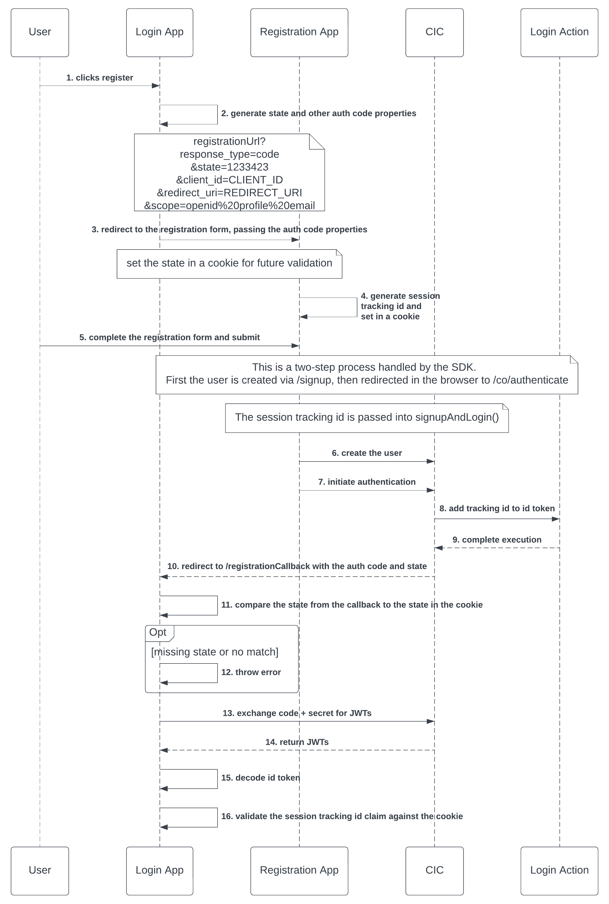

## Custom Registration w/ Auth Code Flow + Session Tracking
This POC shows how to create a custom registration application that registers the user in CIC (previously Auth0), then automatically logs them in using [cross-origin authentication](https://auth0.com/docs/authenticate/login/cross-origin-authentication). A tracking id is generated by the [registration application]](./Registration/) to track the user through the authentication process. This is especially handy when using a [redirect action](https://auth0.com/docs/customize/actions/flows-and-triggers/login-flow/redirect-with-actions) to send the user to an intermediary application such as custom MFA registration.   

  

### Login Application  
The [Login application](./Login/) acts as the authenticating application. See the [application specific readme](./Login/README.md) for instructions on configuration and running locally.

#### Registration
The "Registration" button generates the required OAuth parameters to initiate the [authorization code flow](https://auth0.com/docs/get-started/authentication-and-authorization-flow/authorization-code-flow) and passes them to the [Registration Application](./Registration/) in a redirect.  
* response_type=code
* state={randomly generated string}
* client_id={application client id}
* redirect_uri={callback URI}
* scope=openid profile email
* audience={API identifier} [optional]  

 #### Custom Callback  
 The custom callback (/registrationCallback) is responsible for validating the *state* and exchanging the *code* for JWTs. Normally the SDK handles this functionality but because the authentication flow was initiated by the registration app, it must be handled manually. 

 Additionally, the JWTs in the response must also be handled outside of the SDK. 

 The callback is also responsible for validating the session id. This validation can only be completed after exchanging the code for a token. 

 **Optionally** The custom callback can validate the state and initiate a login via the SDK. The login will remove the need for custom logic to exchange the code and manage the JWTs. 
 
The following logic in the [/registrationCallback](./Login//routes//index.js) can be replaced with 
```javascript
 const code = req.query?.code;
    if (!code) throw new Error("missing code");

    const authResult = await axios({
      url: `${process.env.ISSUER_BASE_URL}/oauth/token`,
      method: "POST",
      data: {
        grant_type: "authorization_code",
        redirect_uri: process.env.REDIRECT_URI,
        code: req.query.code,
        client_id: process.env.CLIENT_ID,
        client_secret: process.env.CLIENT_SECRET,
      },
    });
    const user = jwt_decode(authResult.data.id_token);    

    res.render('profile', {
      userProfile: JSON.stringify(user, null, 2),
      title: 'Profile page'
    });    
```
 **this**
 ```javascript
  res.oidc.login({
    returnTo: "profile"
  })   
 ```

 #### Authentication  
 Unlike registration, the login functionality uses the [express-openid-connect](https://github.com/auth0/express-openid-connect) SDK. 

 ### Registration Application  
The [Registration application](./Registration/) acts as a centralized registration page. It's recommended to use the [CIC Universal Login](https://auth0.com/docs/authenticate/login/auth0-universal-login/new-experience) but due to feature limitations (no custom fields etc.), a custom registration application may be required. An in-depth comparison of the Universal Login vs. Embedded Login can be found [here](https://auth0.com/docs/authenticate/login/universal-vs-embedded-login). See the [application specific readme](./Registration/README.md) for instructions on configuration and running locally.  


#### Signup  
The registration application has a single route, [/signup](./Registration/routes/signup.js). Consuming applications should redirect to /signup with the appropriate OAuth parameters. It will then generate a session id, store it in a cookie, and render the signup form.

#### Signup Form  
The signup form collects the user's email and password, then initiates signup + login. When completed, the user is redirected back to the originating application, in this case the Login application's /registrationCallback route. 

## Security  
[Cross-origin authentication](https://auth0.com/docs/authenticate/login/cross-origin-authentication) is not a recommended authentication implementation and should be reviewed by a security team prior to use.

### Concerns  
* Credentials are collected in app making it easier for malicious users to phish your customers. 
* Credentials are sent in the browser, across origins, in plain text. 
* The registration application and CIC tenant's ([custom domain](https://auth0.com/docs/customize/custom-domains)) must be on the same top-level domain, otherwise cross-origin authentication breaks if 3rd party cookies are blocked or disabled  

    [Limitations](https://auth0.com/docs/authenticate/login/cross-origin-authentication#limitations)  

## Login Action  
A [login action](https://auth0.com/docs/customize/actions/write-your-first-action#create-an-action) is required for enriching the id token with the session id. When the authenticating application's callback recieves the id token, it extracts the sessionId claim and compares it to the sessionId in the cookie.  

  1. Create a [login action]([link](https://auth0.com/docs/customize/actions/write-your-first-action#create-an-action))
  2. Copy the code from [addSessionId.js](./CICLoginActions//addSessionId.js), save, and deploy the action 
 

 ## Testing  
 1. Configure both applications by following the instructions in their readme  
 2. Navigate to the Login application (localhost:3000) and click Register
 3. You'll redirect to the Registration application
 4. Coomplete the registration form and submit
 5. Your account is created and you'll be redirected back to the Login application's registrationCallback  
