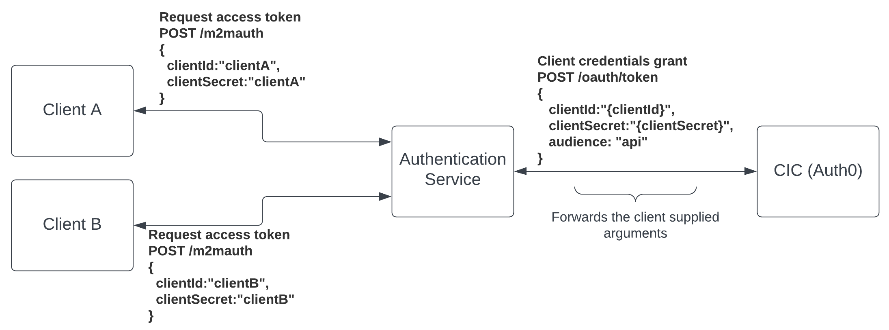

## M2M Authentication from multiple clients
A common use case is the need for providing API access to your customers. This case be handled using the [client credentials flow](https://auth0.com/docs/get-started/authentication-and-authorization-flow/client-credentials-flow) also known as the machine-to-machine (M2M) flow. Each customer is provided a client id and secret to request an access token. The access token is then used in requests to your API. 

Customers must not make make direct calls to CIC (Auth0). Doing so can lead to [rate limit](https://auth0.com/docs/troubleshoot/customer-support/operational-policies/rate-limit-policy) issues affecting other parts of your system. Instead, a proxy service should sit between your customers and CIC (Auth0). This service can monitor the rate limit headers in the response and throttle as necessary. It also allows custom analytics to track how often your customers request new tokens.  

The [ClientA](./ClientA/) and [ClientB](./ClientB/) console applications represent customers and the [Authentication service](./AuthenticationService/) acts as the proxy. Additionally, the Authentication service supports user interactive logins via the [authorization code flow](https://auth0.com/docs/get-started/authentication-and-authorization-flow/authorization-code-flow). 

### High-level Architecture  
  

### Sequence Diagram  
  

## Authentication Service
The Authentication service is based on the CIC (Auth0) [node.js express quick start](https://auth0.com/docs/quickstart/webapp/express/01-login) with an additional route (/m2mauth) supporting the M2M proxy flow. 

### M2M Auth
The M2M auth route initiates the client credentials flow using the request body. The actual M2M request is handled by the [node-auth0](https://github.com/auth0/node-auth0) module.  

**Route:** /m2mauth  
**Action:** POST  
**Body:**
```json
{
  "clientId": "uNtntSBJnrbys", 
  "clientSecret": "SAeDT6Ose97BbEx2_JSvqz", 
  "permissions":"read:data write:data"
}
```
## Client Credentials Action 
The Machine to Machine action executes during the client credentials flow, including when requesting a [management API](https://auth0.com/docs/api#management-api) token.  

The [addCustomerId](./CICM2MActions/addCustomerId.js) M2M action gets the customer id from the authenticating application's metadata and adds it to the access token in a custom claim. Having the customer id in the access token will make authorization easier for your APIs.

## Configure the CIC (Auth0) Tenant
### Configure API in CIC  
1. Create an [API](https://auth0.com/docs/get-started/auth0-overview/set-up-apis)  
2. Set an identifier (audience) and accept the default settings
    - The identifier is used to retrieve access tokens
    - Set this value to the AUDIENCE environment variable  
3. Navigate to the permissions tab and create atleast two permissions
    - Set a combination of these permissions to the PERMISSIONS environment variable  
    - read:data  
    - write:data      

### Configure the Authentication Service Application in CIC
1. Create a [web application](https://auth0.com/docs/get-started/auth0-overview/create-applications/regular-web-apps)
2. Add the following URIs to the allowed callback URLs
    - http://localhost:3001/callback    
3. Add the following URI to the allowed logout URLs
    - http://localhost:3001
4. Enable a connection with atleast one user

### Create M2M Action
  1. Create an [M2M action](https://auth0.com/docs/customize/actions/write-your-first-action#create-an-action)
  2. Copy the code from [addCustomerId](./CICM2MActions/addCustomerId.js), save, and deploy the action 
 
### Configure the ClientA M2M Application
1. Create an [M2M Application](https://auth0.com/docs/get-started/auth0-overview/create-applications/machine-to-machine-apps)
2. Authorize the application to access the API created above
3. Assign the desired perrmissions
4. Scroll to the bottom of the *settings* tab and expand *Advanced Settings*
5. In the [*Application Metadata*](https://auth0.com/docs/get-started/applications/configure-application-metadata), add the key customerId and set the value to a string representing the actual customer id 

### Configure the ClientB M2M Application
1. Create an [M2M Application](https://auth0.com/docs/get-started/auth0-overview/create-applications/machine-to-machine-apps)
2. Authorize the application to access the API created above
3. Assign a different set of permissions than ClientA
4. Scroll to the bottom of the *settings* tab and expand *Advanced Settings*
5. In the [*Application Metadata*](https://auth0.com/docs/get-started/applications/configure-application-metadata), add the key customerId and set the value to a string representing the actual customer id 

## Configure Applications
1. [Authentication Service](./AuthenticationService/README.md)
2. [ClientA](./ClientA/README.md)
3. [ClientB](./ClientB/README.md)

 ## Testing  
After configuring the CIC tenant and applications

1. Navigate to the root of the Authentication service application and execute the following command in the console
```bash
  npm start
```
2. In a new window/tab, navigate to the root of the ClientA and execute the following command in the console
```bash
  npm start
```
3. In a new window/tab, navigate to the root of the ClientB and execute the following command in the console
```bash
  npm start
```

